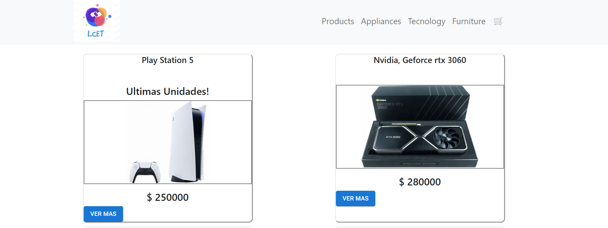
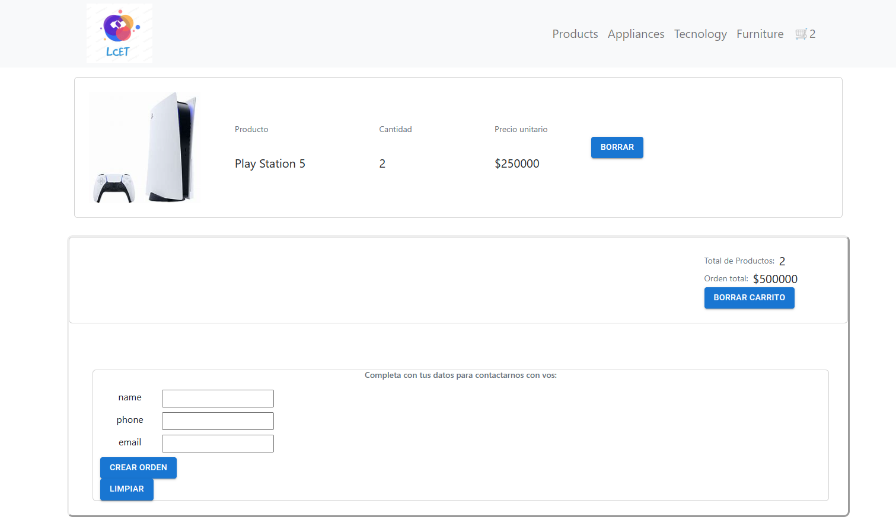
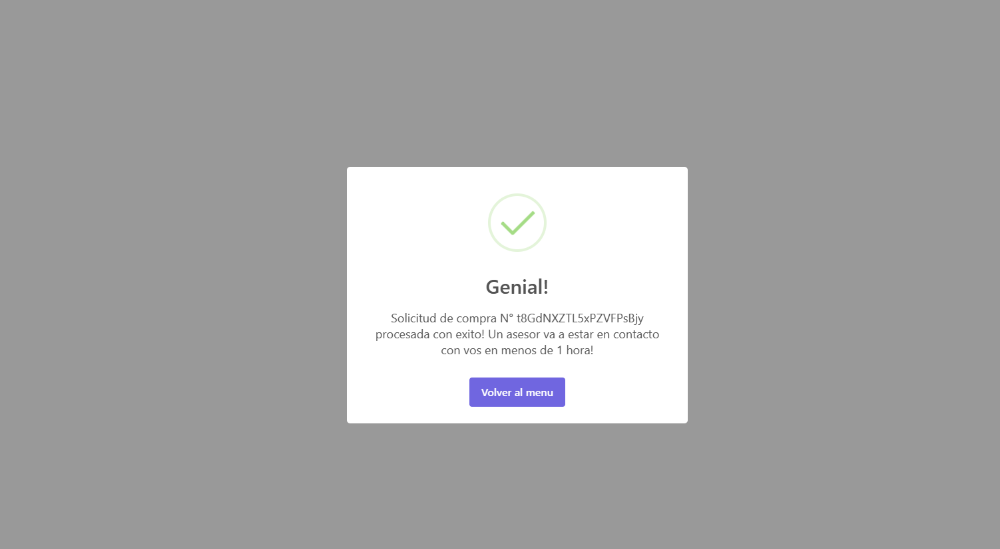
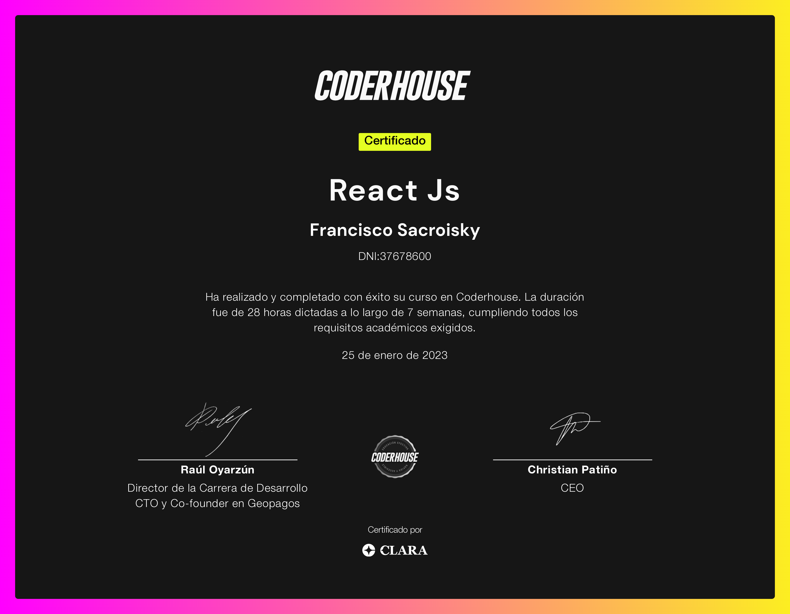

third<h1 >🛠️ Third project </h1>

<h2 >This is the Third project for ReactJs course provided by Coder House.  </h2>

*Objective* : _E-commerce app to be able to sell products of a chosen item._

#  [Page 🚀](https://sacroisky-francisco-react.vercel.app/)
### Must be delivered

  <li>NavBar
</li>
  <li>CartWidget</li>
  <li>ItemListContainer // ItemList // ItemDetailContainer</li>
    <li>ItemDetail // ItemQuantitySelector</li>
      <li>Description // AddItemButton</li>
        <li>Checkout //Brief </li>

 ### 🔩Small sample:

## 📄 Certificate

### 🚀 [Coder House Page](https://www.coderhouse.es/)

